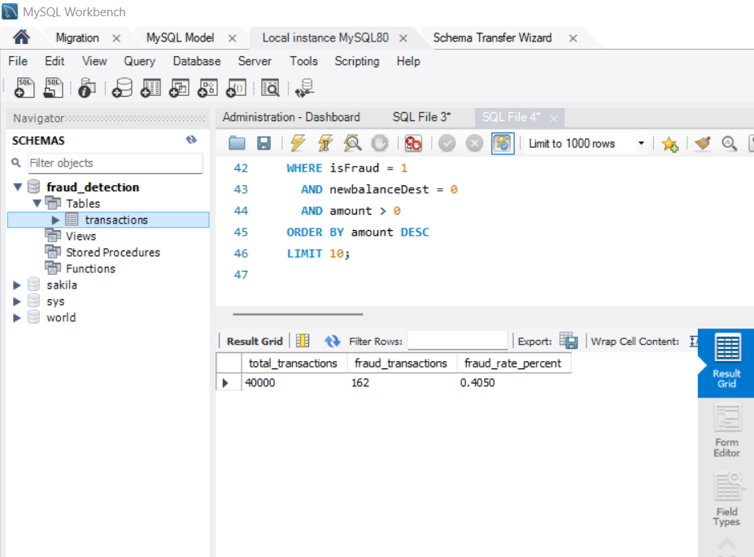
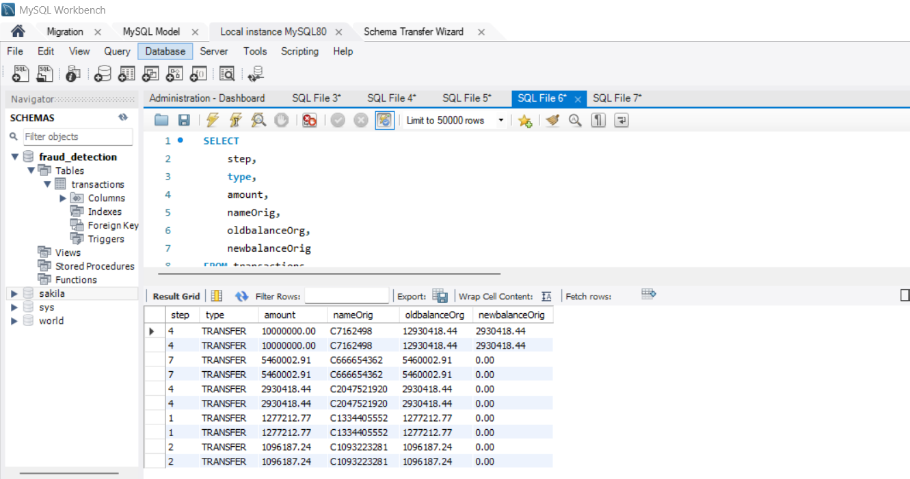

# Fraud Detection Using SQL

This project explores patterns of fraudulent behaviour within an online payments dataset using SQL.  
The objective was to analyse transaction activity, identify high-risk behaviours, and generate insights that may help prevent financial fraud.

The analysis was carried out in MySQL Workbench using a sample of 40,000 transaction records.

---

## 🔍 Project Goals

- Investigate transaction behaviour across different payment types
- Detect unusual or suspicious activity
- Measure the proportion of fraudulent transactions
- Highlight accounts and transaction patterns that require attention

---

## 🗂️ Dataset Information

The dataset includes the following fields:

- step (hour of simulation)
- type (TRANSFER, CASH_OUT, PAYMENT, etc.)
- amount
- account origin and destination balances
- fraud indicators (isFraud and isFlaggedFraud)

Source: Online payments fraud dataset (publicly available)

---

## ✅ Key SQL Queries Used

---

### 1️⃣ Overall fraud rate

```sql
SELECT
    COUNT(*) AS total_transactions,
    SUM(CASE WHEN isFraud = 1 THEN 1 ELSE 0 END) AS fraud_transactions,
    ROUND(100 * SUM(CASE WHEN isFraud = 1 THEN 1 ELSE 0 END) / COUNT(), 4) AS fraud_rate_percent
FROM transactions;
```

---

### 2️⃣ Fraud rate by transaction type

```sql
SELECT 
    type,
    COUNT(*) AS total_txn,
    SUM(CASE WHEN isFraud = 1 THEN 1 ELSE 0 END) AS fraud_txn,
    ROUND(100 * SUM(CASE WHEN isFraud = 1 THEN 1 ELSE 0 END) / COUNT(), 4) AS fraud_rate_percent
FROM transactions
GROUP BY type
ORDER BY fraud_rate_percent DESC;
```

---

### 3️⃣ Top high-value confirmed fraud transactions

```sql
SELECT 
    step,
    type,
    amount,
    nameOrig,
    oldbalanceOrg,
    newbalanceOrig
FROM transactions
WHERE isFraud = 1
    AND newbalanceDest = 0
    AND amount > 0
ORDER BY amount DESC
LIMIT 10;
```
## 📌 Project Screenshots

### ✅ Schema & Table


### ✅ Overall Fraud Rate


### ✅ Fraud Rate by Transaction Type


### ✅ Top 10 High-Value Fraud Cases


---

## 🎯 Key Insights & Findings

### ✅ 1. Very low overall fraud rate
- Only **0.40%** of all transactions were confirmed as fraud
- Shows that fraud is **rare but high-impact**

---

### ✅ 2. Fraud happens mostly in specific transaction types
- **TRANSFER** and **CASH_OUT** have the highest fraud rates
- These involve moving money between accounts → higher risk
- **PAYMENT** and **CASH_IN** had almost **no fraud**

📌 *Insight:* Fraudsters prefer transactions where money leaves the system.

---

### ✅ 3. High-value frauds follow a pattern
- Top fraudulent transactions involved **very large amounts**
- Most had **newbalanceDest = 0**, meaning:
  - money was withdrawn instantly
  - receiving account did not keep balance

📌 *Insight:* This suggests **money-mule or instant cash-out behaviour**

---

### ✅ 4. Flagged fraud is not always real fraud
- Many transactions marked as `isFlaggedFraud = 1` were **not truly fraudulent**
- Shows the system produces **false positives**

📌 *Insight:* Fraud detection rules need improvement

---

### ✅ Final Conclusion
- Fraud is rare but strategic in **large-value TRANSFER/CASH_OUT**
- Monitoring should focus on:
  ✔ sudden high transfers  
  ✔ zero final balance accounts  
  ✔ repeated withdrawals to new accounts

### ✅ Power BI – Overall Fraud Rate


### ✅ Power BI – Fraud by Transaction Type


